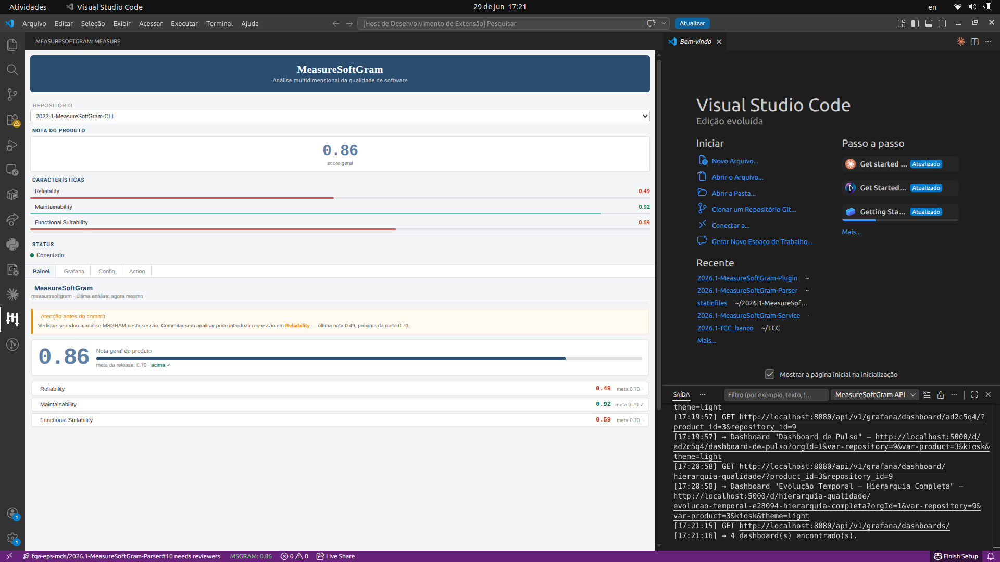
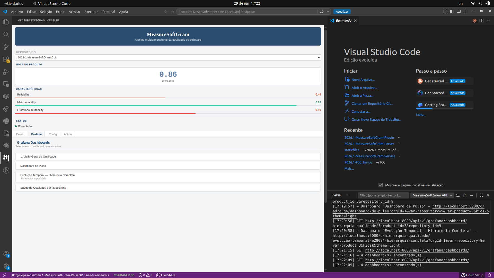
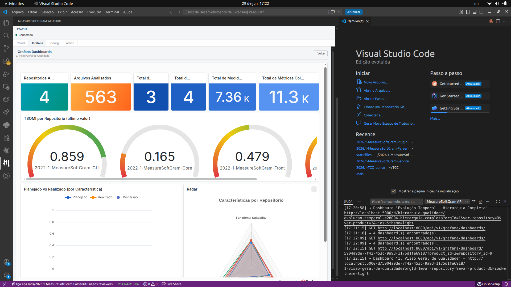
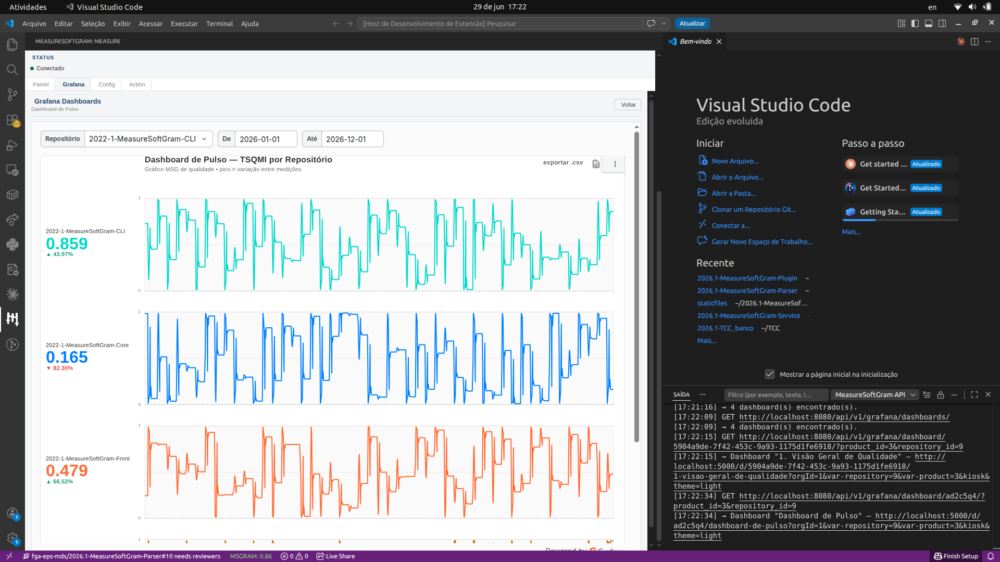
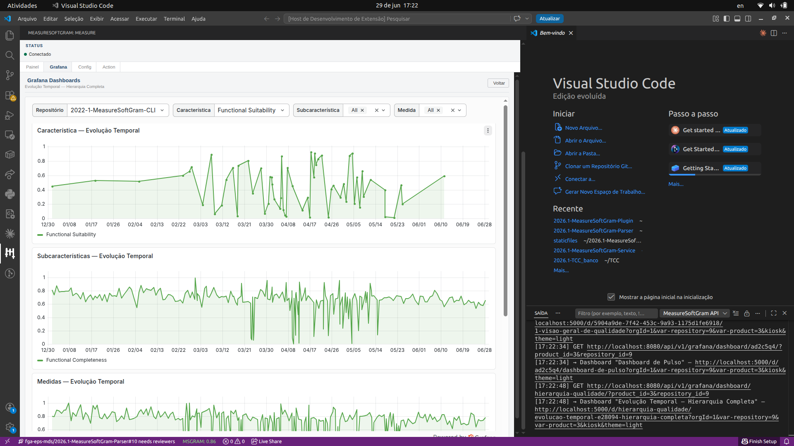
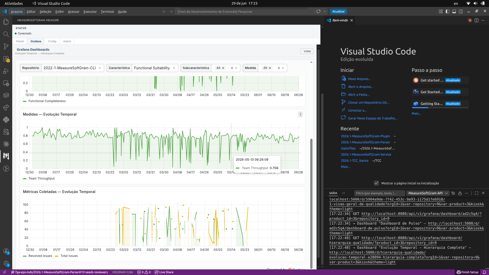
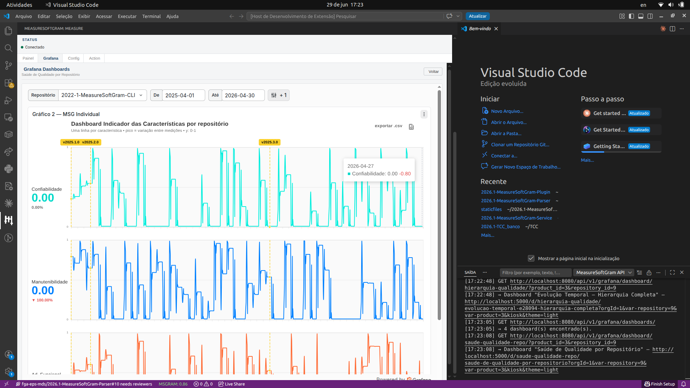

# MeasureSoftGram

**Análise multidimensional da qualidade de software, diretamente no VS Code.**

[](https://www.gnu.org/licenses/agpl-3.0)

---


---

## Features

**Dashboard de qualidade por release**


Acompanhe a evolução das características de qualidade (manutenibilidade, confiabilidade, usabilidade...) ao longo do tempo, com indicadores agregados entre 0 e 1.

---

**Comparação meta x realizado**


Defina metas de qualidade por release e veja exatamente onde o time ficou acima ou abaixo do planejado — característica por característica.

---

** Configuração de pesos e características**


Ajuste quais características de qualidade monitorar e o peso relativo de cada uma para o contexto do seu projeto.

---

## Como usar

1. Instale a extensão e tenha conta no [MeasureSoftGram](https://msgram.lappis.rocks/)
2. Clique no ícone **MeasureSoftGram** na Activity Bar
3. Ou abra via paleta: `Ctrl+Shift+P` → `MeasureSoftGram: Abrir Painel`
4. Logue com sua conta no MeasureSoftGram e pronto!

---

## Sobre o modelo

O MeasureSoftGram usa um **metamodelo algébrico original** (produto de Hadamard + norma de Frobenius) para agregar métricas brutas em indicadores multidimensionais de qualidade.

[Site oficial](https://msgram.lappis.rocks/) · [Issues](https://github.com/fga-eps-mds/MeasureSoftGram-Plugin/issues) · [Docs](https://github.com/fga-eps-mds/MeasureSoftGram-Plugin)

---

### Painel principal

Após salvar as configurações, o painel exibe o score geral (TSQMI), as três características de qualidade com valores e metas, e o aviso de regressão antes do commit.



### Log de requisições

O plugin registra todas as chamadas feitas ao service. Para visualizar:

1. Abra **View → Output** no VS Code
2. No dropdown do painel Output, selecione **MeasureSoftGram API**

Exemplo de log esperado:

```
[14:52:01] GET http://localhost:8080/api/v1/organizations/
[14:52:01] → Organização: "fga-eps-mds" (id=1)
[14:52:01] GET http://localhost:8080/api/v1/organizations/1/products/
[14:52:01] → Produto: "MeasureSoftGram" (id=3)
[14:52:01] GET http://localhost:8080/api/v1/organizations/1/products/3/repositories/
[14:52:01] → 4 repositório(s): 2022-1-MeasureSoftGram-CLI, ...
[14:52:01] Buscando métricas para repositório "2022-1-MeasureSoftGram-Service" (id=6)
[14:52:01] → TSQMI: 0.9830
[14:52:01] → Reliability: 0.4782
[14:52:01] → Maintainability: 0.9984
```

### Django Admin (apenas ambiente local)

Acesse `http://localhost:8080/admin` (usuário `admin`, senha `admin`) para navegar pelas entidades e conferir os dados no banco.

---

## 6. Integração com Grafana

A aba **Grafana** exibe dashboards do Grafana diretamente dentro do VS Code, sem abrir o browser. O plugin busca a lista de dashboards via API do MeasureSoftGram Service e carrega cada um como iframe, já filtrado pelo produto e repositório atualmente selecionados.

> **Pré-requisito:** o plugin não se conecta ao Grafana diretamente — todas as chamadas passam pelo MeasureSoftGram Service, que atua como proxy. O que precisa estar garantido é que a versão do service em uso (local, homologação ou produção) disponibilize os endpoints:
> - `GET /api/v1/grafana/dashboards/`
> - `GET /api/v1/grafana/dashboard/{uid}/`
>
> Esses endpoints estão disponíveis a partir da branch `feat/US06` do service. Para verificar se o ambiente que você está usando os expõe, execute:
> ```bash
> curl -s -o /dev/null -w "%{http_code}" \
>   -H "Authorization: Token SEU_TOKEN" \
>   http://SEU_SERVICE_URL/api/v1/grafana/dashboards/
> # Resposta esperada: 200
> ```
>
> **Ambiente local:** o Grafana sobe automaticamente junto com o service via `docker compose up -d` (porta `5000`). Nenhuma configuração adicional é necessária.
>
> **Homologação / Produção:** o Grafana precisa estar acessível a partir do service implantado e configurado pelas variáveis de ambiente `GRAFANA_BASE_URL` e `GRAFANA_PUBLIC_URL` no servidor. Do lado do plugin, basta que o service responda aos endpoints acima — a URL do Grafana em si é retornada pelo service e usada internamente pelo iframe.

### Lista de dashboards disponíveis

Ao clicar na aba **Grafana**, o plugin consulta o service e lista os dashboards cadastrados. São 4 dashboards, cada um cobrindo um aspecto diferente da qualidade.



---

### Dashboard 1 — Visão Geral de Qualidade

Visão consolidada do produto. Exibe contadores gerais (repositórios analisados, arquivos, características, medidas e métricas coletadas), os gauges de TSQMI por repositório com o último valor calculado, o gráfico de barras **Planejado vs Realizado** por característica e um radar comparando as características entre os repositórios.



---

### Dashboard 2 — Dashboard de Pulso (ECG)

Exibe a evolução do TSQMI ao longo do tempo no formato de "batimento cardíaco" (ECG), uma linha por repositório. Permite filtrar por repositório e por intervalo de datas. Útil para identificar instabilidades e períodos de queda na qualidade.



---

### Dashboard 3 — Evolução Temporal — Hierarquia Completa

Dashboard filtrado por repositório e característica (Reliability, Maintainability, Functional Suitability). Mostra a evolução temporal em quatro camadas da hierarquia de qualidade: **Características → Subcaracterísticas → Medidas → Métricas Coletadas**.

**Parte superior** — Característica e Subcaracterísticas ao longo do tempo:



**Parte inferior** — Medidas e Métricas Coletadas (Resolved issues vs Total issues):



---

### Dashboard 4 — Saúde de Qualidade por Repositório

Exibe a evolução de cada característica individualmente em formato de série temporal, com marcadores de release (v2025.1.0, v2025.2.0, v2025.3.0). Permite identificar o impacto de cada versão sobre Confiabilidade, Manutenibilidade e Adequação Funcional.



---

## Modo sem service (dados mockados)

Quando o plugin é aberto **sem** as configurações preenchidas, ele exibe automaticamente dados mockados para facilitar o desenvolvimento de UI:

| Campo | Valor mock |
|---|---|
| Score (TSQMI) | `0.94` |
| Reliability | `0.82` (meta 0.8) |
| Maintainability | `0.68` (meta 0.75) |
| Security | `0.71` (meta 0.7) |

O log indicará: `Sem configuração — usando dados mockados.`

---

## Parar o service local

```bash
cd ../2026.1-MeasureSoftGram-Service
docker compose down
```

---

## Scripts disponíveis

| Comando | Descrição |
|---|---|
| `npm run install:all` | Instala dependências da extensão e da webview |
| `npm run build:webview` | Compila o frontend React da sidebar |
| `npm run compile` | Compila o código TypeScript da extensão |
| `npm run watch` | Recompila automaticamente ao salvar arquivos |
| `npm run lint` | Executa o ESLint |
| `npm run test:coverage` | Executa os testes com relatório de cobertura |
